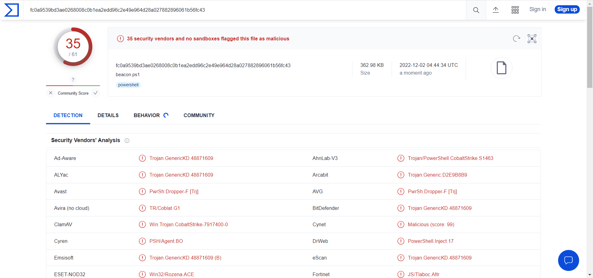
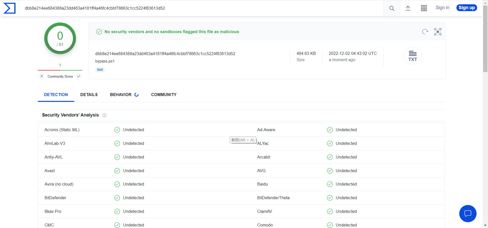
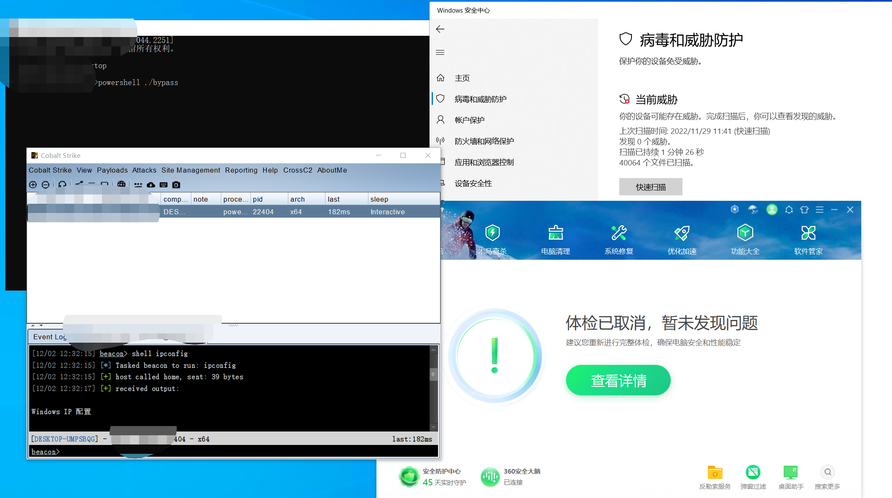

# Obfuscator

> forked from hxxps://github[.]com/H4de5-7/powershell-obfuscation (hxxps://github[.]com/test1213145/powershell-obfuscation)

Simple and effective powershell obfuscation free obfuscator gadget, VT all green, can bypass Defender, 360, etc.

AMSI bypass + powershell command obfuscation

**Please do not use it for any illegal purposes, or bear the consequences.**

The above test environments are all physical machines.

## Thoughts

Having looked at powershell anti-obfuscation related content and papers, the best anti-obfuscation at the moment would be 2022 QAX's [Invoke-Deobfuscation: AST-Based and Semantics-Preserving Deobfuscation for PowerShell Scripts](https://ieeexplore.ieee.org/document/9833705), which continues and improves on [the idea of ZJU in CCS (2019)](https://dl.acm.org/doi/pdf/10.1145/3319535.3363187), using variable tracking and invoke-deobfuscation at the AST level, which is a static analysis plus partial dynamic analysis, and is quite a bit better than defender and VT.

**However, the paper also mentions the difficulties of current powershell anti-obfuscation research, one is that the custom function encryption can not be solved, and the other is that it is very difficult to track the variables in the loop.**

As the current research on Powershell anti-obfuscation does not have much research on static code analysis, it is not as effective as static code analysis in C/Java in tracking the invocation and propagation of variables, so there is no good solution for the propagation of variables in loops for the time being.

Meanwhile, function calls may require more complex dynamic analysis, and the problem of function nesting has to be taken into account, so there is no good solution for the time being.
The above two points may be the future of powershell anti-obfuscation need to study the content.

Since some anti-obfuscation tools will do anti-obfuscation work at the AST level, most of the encryption/decryption/encoding/decoding functions that come with powershell are useless, such as `[System.Convert]::FromBase64String`, etc. You should use customized encryption/decryption functions as much as possible.

Should be as far as possible to use custom encryption and decryption function. Here for these two academic research difficulties, wrote a simple powershell obfuscator, the fact that the effect is really good. Specific ideas are as follows:

1. Custom encryption and decryption function, function in the string of the reverse order (reverse order did not use powershell's own functions, to prevent confusion on the level of the AST) and the bit of the + operation (do not use the different-or operation of the reason is that the defender is very strict on the -bxor monitoring).
2. Perform several loops on the above functions.
3. To make the characters output efficiently, finally encode them with base64 (it doesn't matter even if they are unencoded at the AST level, because the unencoded content is still obfuscated).

At the same time, AMSI bypass and powershell commands were obfuscated.  Here is just a simple demo of the obfuscator, feel free to play around with it.  I experimented with qax's anti-obfuscation tool and the Unit42 team's anti-obfuscation tool, and neither of them could be solved.
## How to use
- `./powershell-obfuscation.ps1 -c "whoami"` to obfuscate the command

- `./powershell-obfuscation.ps1 -f "filename"` to obfuscate the specified file

- The result will be output in `bypass.ps1` in the current directory

- Take `beacon.ps1` in cs as an example:

  

------

Before obfuscation:

------

After obfuscation:

------

Hacked:

